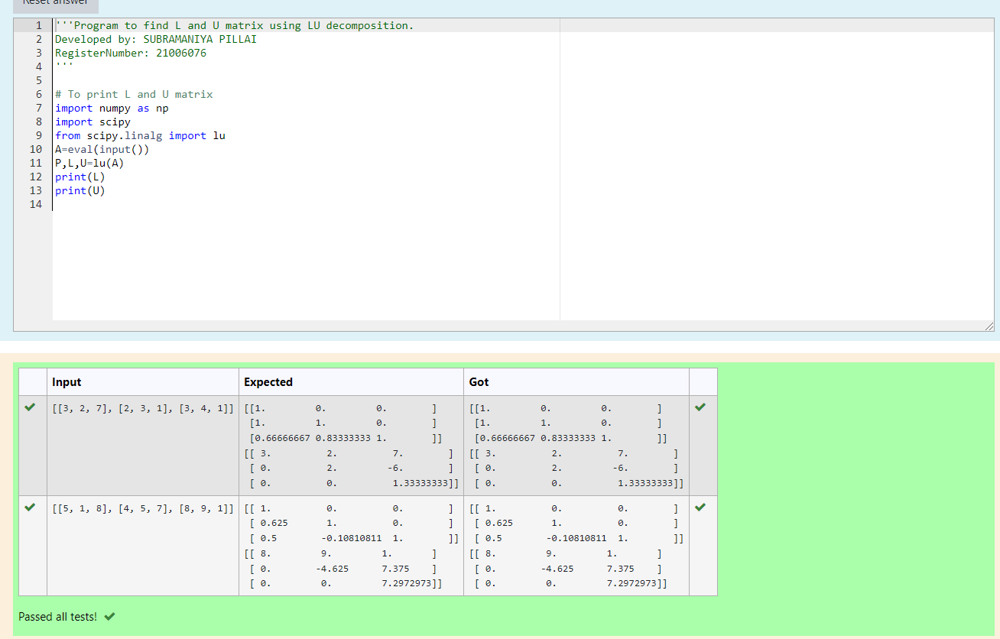
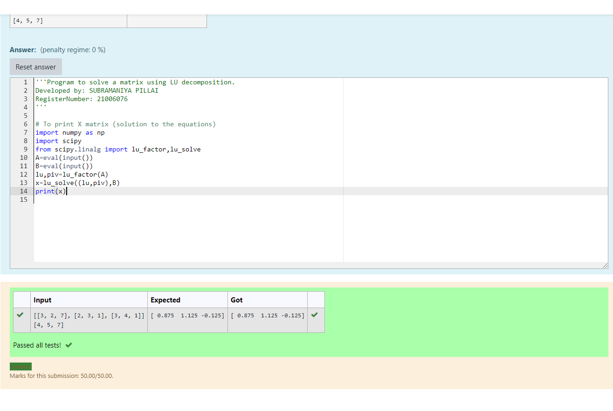

# LU Decomposition without zero on the diagonal

## AIM:
To write a program to find the LU Decomposition of a matrix.

## Equipments Required:
1. Hardware – PCs
2. Anaconda – Python 3.7 Installation / Moodle-Code Runner

## Algorithm
1. first import numerical python as np
2.  then import scientific python
3. from scipy.linalg import lu
4. print[l],[u]

## Program 1:

/*
Program to find the LU Decomposition of a matrix.
Developed by: SUBRAMANIYA PILLAI.B
RegisterNumber:21006076 
*/
```
import numpy as np
import scipy
from scipy.linalg import lu
A=eval(input())
P,L,U=lu(A)
print(L)
print(U)
```
## Program 2:

/*Program to solve a matrix using LU decomposition.
Developed by: SUBRAMANIYA PILLAI
RegisterNumber: 21006076
*/
```

import numpy as np
import scipy
from scipy.linalg import lu_factor,lu_solve
A=eval(input())
B=eval(input())
lu,piv=lu_factor(A)
x=lu_solve((lu,piv),B)
print(x)
```


## Output 1:

## Output 2:



## Result:
Thus the program to find the LU Decomposition of a matrix is written and verified using python programming.

